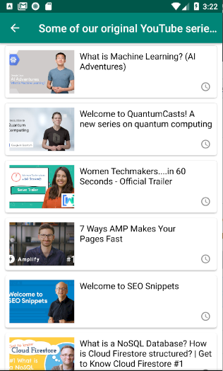

# YTPlayer 
  
## Setup Project

Add this to your project build.gradle

Project-level build.gradle (<project>/build.gradle):

``` gradle 
allprojects {
    repositories {
        google()
        jcenter() 
        maven { url 'https://jitpack.io' } 
    }
}
```

Add this to your project build.gradle

Module-level build.gradle (<module>/build.gradle): 

#### [](https://jitpack.io/#appsfeature/YTPlayer)
```gradle  

dependencies {
    implementation 'com.github.appsfeature:YTPlayer:x.y'
} 
```

## Setup Google Developers Console
```
  To get started, you need a googleApiKey with YouTube Data API v3 enabled:
  Enable YouTube Data API v3 service. Go to mentioned url below for register a new developer key.  
  URl : https://console.developers.google.com 
```

   
<p align="center">
  
  
  
</p>
In your activity class:
#### Usage method
```java 
      YTPlayer ytPlayer = YTPlayer.getInstance(this, DeveloperKey.DEVELOPER_KEY)
              .setPlayerType(YTPlayer.VideoType.OPEN_INTERNAL_PLAYER);
              
               // For open single video
               ytPlayer.setPlayerType(YTPlayer.VideoType.OPEN_INTERNAL_PLAYER);
               ytPlayer.openVideo(YOUTUBE_VIDEO_ID);
               
               // For open video playlist
               ArrayList<YTVideoModel> playList = new ArrayList<>();
               YTVideoModel videoDetail = YTVideoModel.Builder()
                           .setVideoId("3gQym6mF2Jw")
                           .setTitle("How to Create a VR App for Android in 7 Minutes")
                           .setDuration("9.5");
               playList.add(videoDetail);
               ytPlayer.openPlaylist("Youtube", playList);
               
               // For open video playlist by channelId
               ytPlayer.openPlaylist("Player Name", "UC_x5XG1OV2P6uZZ5FSM9Ttw"); 

               // For open single video in external youtube player
               ytPlayer.setPlayerType(YTPlayer.VideoType.OPEN_EXTERNAL);
               ytPlayer.openVideo(YOUTUBE_VIDEO_ID);
                
               // For open video playlist in external youtube player
               ytPlayer.openPlaylist(YOUTUBE_PLAYLIST);
                                
```

#### Useful Links:
1. https://console.developers.google.com 
